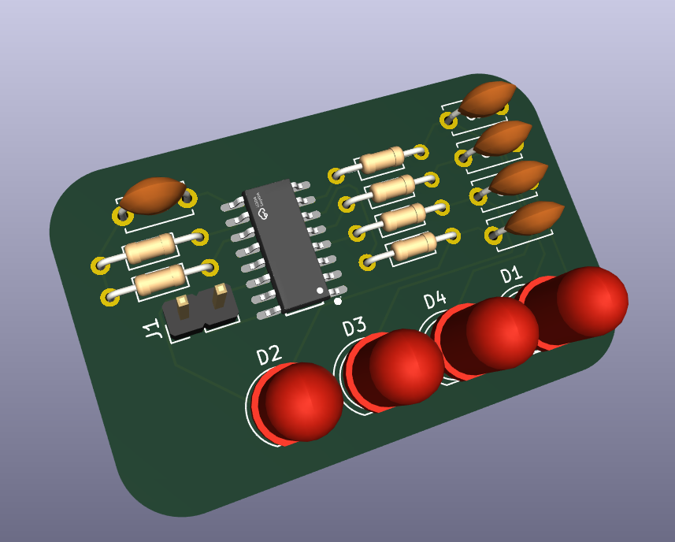
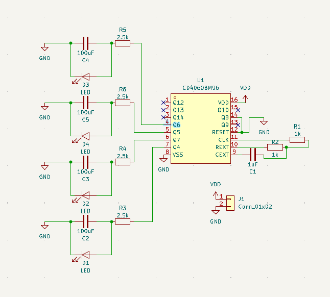

# CD4060-RC-Blinker
I made an CD4060 binary blinker that goes through 4 LEDs while using RC timers to slowly turn them on and off. I made it because I wanted to test myself and try to combine the earlier week projects with this current week's project.  
  

## Hardware

[KiCanvas Link](https://kicanvas.org/?repo=https%3A%2F%2Fgithub.com%2FAsurant%2FCD4060-RC-Blinker%2Ftree%2Fmain%2Fsrc%2Fkicad)
### Schematic

### PCB

