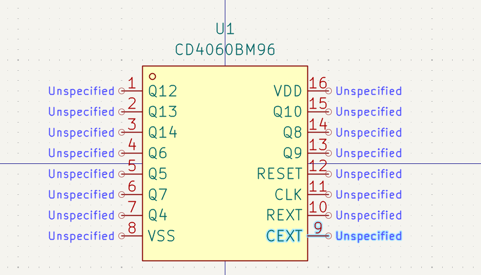
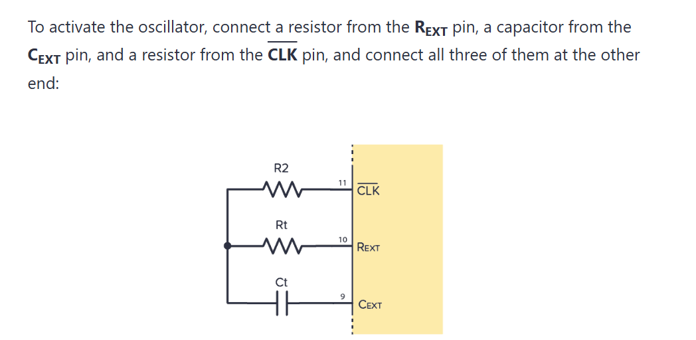
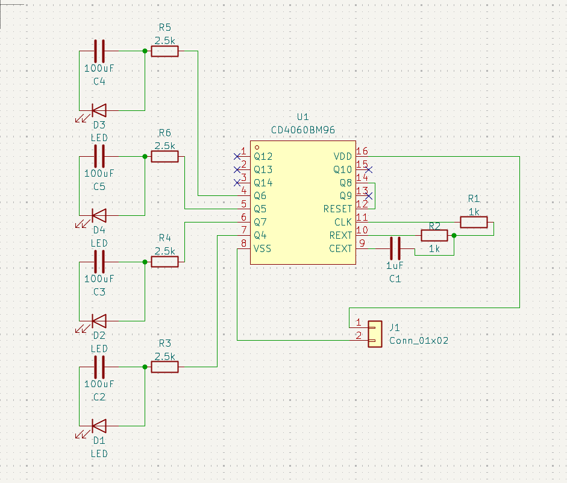
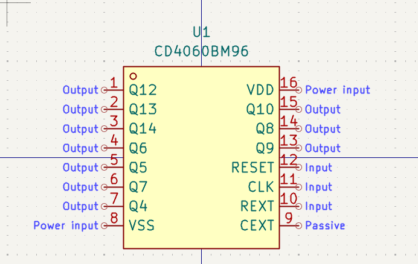
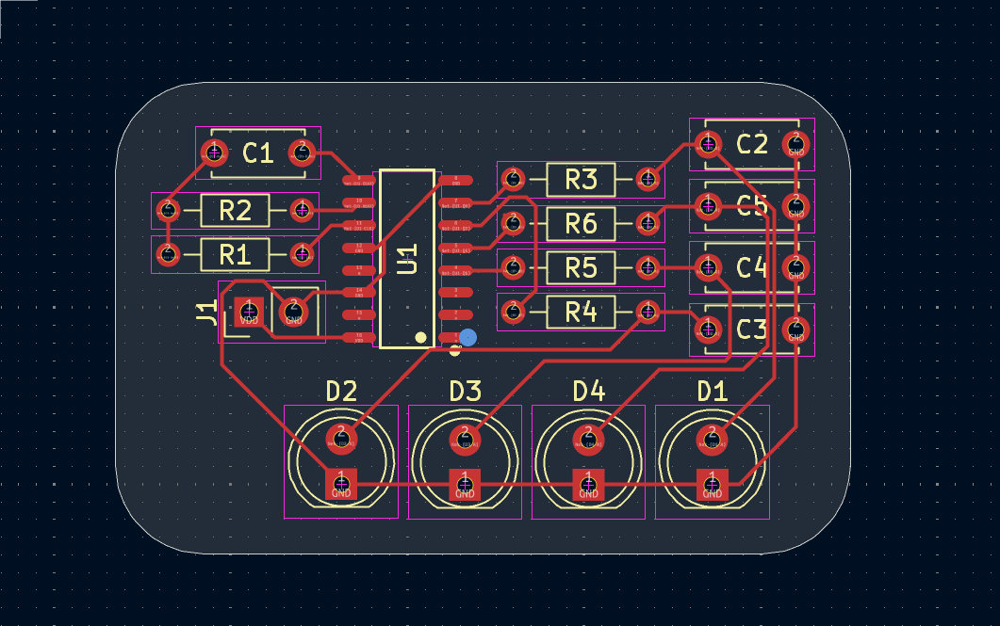

# CD4060 RC Blinker

I'm building a PCB that uses a CD4060 and RC circuits to slowly blink through LEDs

## 5/18/2026 - Brainstorming

I spent some time deciding on what to make and was originally going to make a CD4060 vs CD4017 LED blinking comparison but instead decided to combine what I learned in earlier weeks. I had to jog my memory on how CD4060s worked and needed to do some research in order to job my memory. Along with this I had to rename a few of the pins into names that were more widely used to avoid confusion. PHII --> CLK, PHIO --> REXT, and the second PHIO --> CEXT  

  
### Time Spent: 0.4 Hours

## 5/18/2026 - Schematic

I put together the schematic for the progress. I set up the timer so that it should blink the first LED in about 0.3 seconds after starting. Normally it would be slower however, the CD4060 is set up so that the first pin is actually the 5th bit with no pinouts for bits 1 through 4. Along with this I set up the RC circuits so they would last approximately 0.25 seconds. Each one is designed to dim in and out in the same amount of time.  

### Time Spent: 0.4 Hours

## 5/18/2026 - Footprints And ERC

I assigned all the footprints for the parts. Luckily since I used easyeda2kicad I didn't have to deal with trying to figure out the correct footprint for a cd4060. When I went back to check the ERC I discovered I was having issues with the pin connections and how for some reason that I was having errors. It took me some time to figure it out but the issue ended up being that all of the pins weren't assigned an electrical type so I had to assign them myself.  

### Time Spent: 0.4 Hours

## 5/18/2026 - Footprints And ERC

I routed all of the parts together. I didn't really have any issues and surprisingly managed to only use the front side for the connections without needing to use vias. Most of the time was spent trying to get it organized right so it had consumed quite the amount of time for me.  

### Time Spent: 1 Hour
